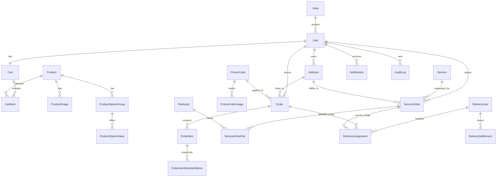

# Alisho Library ERD

The schema separates product orders and service orders, while allowing shared delivery, settlement, notification, and audit flows.

## Core Design Notes

- `Order` and `ServiceOrder` are separate aggregates because their state machines and pricing entry points differ.
- Pricing snapshots are stored directly on orders and service orders:
  `subtotal`, `deliveryFee`, `serviceFee`, `extraFee`, `discount`, `promoCodeCode`, `finalTotal`.
- Product option selections are copied into order item snapshots so history stays stable after catalog edits.
- Shared delivery helpers use `DeliveryAssignment.targetType` with nullable `orderId` and `serviceOrderId`.
- File handling is centralized through `FileAsset`, with guarded downloads through `GET /files/:id`.
